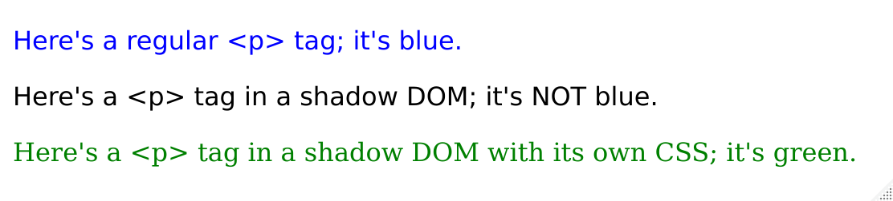

# shadowdom

<!-- badges: start -->

 <!-- badges: end -->

The goal of the shadowdom R package is to make it easy to create pockets of HTML that are not subject to the CSS styling rules of the surrounding document. This is accomplished using the [Shadow DOM](https://developers.google.com/web/fundamentals/web-components/shadowdom), a feature of newer browsers (Internet Explorer 11 is not supported).

## Installation

``` {.r}
remotes::install_github("jcheng5/shadowdom")
```

## Usage

You use `shadowdom::shadow_dom` just like any htmltools tag object. The contents will be rendered without most of the document's CSS styling rules applied.

Here's a simple example that demonstrates how `shadow_dom` alters the normal CSS rules for its contents.

``` {.r}
library(htmltools)
library(shadowdom)

ex <- div(
  # Set some CSS styles for the page
  tags$style(HTML("
    body { font-family: sans-serif; }
    p { color: blue; }
  ")),
  
  p("Here's a regular <p> tag; it's blue."),
  
  shadow_dom(p("Here's a <p> tag in a shadow DOM; it's NOT blue.")),
  
  shadow_dom(all_initial = TRUE,
    tags$style(HTML("p { color: green; }")),
    p("Here's a <p> tag in a shadow DOM with its own CSS; it's green.")
  )
)

print(ex, browse = TRUE)
```



## Usage in R Markdown

The shadowdom package was originally conceived to work with HTML tables produced by the [gt](https://gt.rstudio.com/) package. Tables generated by gt can have a lot of CSS rules, and attempting to embed such tables into highly styled pages can often lead to conflict. You can add `render=shadowdom::shadow_dom_knit_print()` to an R code chunk to wrap each of that chunk's outputs in its own Shadow DOM.

    ```{r shadowdom::shadow_dom_knit_print()}
    exibble %>% gt()
    ```

## Limitations

More work needs to be done to see if Shadow DOM can be used in more complicated scenarios, like htmlwidgets and Shiny controls. For now, only simple HTML fragments with their own <style> tags (or inline styles) are likely to give the desired results.
